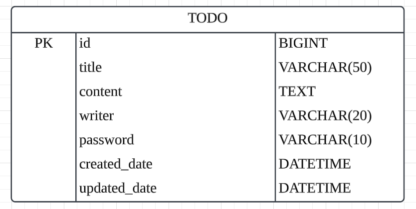

# **📅 [Spring_4기] CH 3 일정 관리 앱 만들기 과제**

## 📌 **필수 기능 가이드** 📌
- **Lv 0 :** API 명세 및 ERD 작성
- **Lv 1 :** 일정 생성 및 조회
- **Lv 2 :** 일정 수정 및 삭제

---

## 🛠️ **과제 흐름** 🛠️
### **Lv 0 :** API 명세 및 ERD 작성

### ✏️ **API 명세서 작성하기**

#### **일정 생성**

- **Description** : 새로운 일정을 생성합니다.
    - 요청 시 일정의 제목, 내용, 작성자명, 비밀번호, 작성일, 수정일을 포함하며, 서버에서 각 일정에 고유 ID를 생성합니다.
- **HTTP Method** : `POST`
- **Endpoint** : `/todos`
- **Request Body**
    
    ```json
    {
        "title" : "제목",
        "content" : "내용",
        "writer" : "작성자명",
        "password" : "비밀번호"
    }
    ```
    
    - `title` (String) : 일정 제목.
    - `content` (String) : 일정 내용.
    - `writer` (String) : 작성자 이름.
    - `password` (String) : 일정 수정/삭제 시 사용할 비밀번호.
    - `created_date` (String) : 작성일.
    - `updated_date` (String) : 수정일.
- **Response**
    
    ```json
    {
        "id" : 1,
        "title" : "제목",
        "content" : "내용",
        "writer" : "작성자명",
        "created_date" : "YYYY-MM-DD HH:mm:ss",
        "updated_date" : "YYYY-MM-DD HH:mm:ss"
    }
    ```
    
    - `id` (Integer) : 자동 생성된 고유 식별자.
    - `title` (String) : 일정 제목.
    - `content` (String) : 일정 내용.
    - `writer` (String) : 작성자 이름.
    - `created_date` (String) : 작성일.
    - `updated_date` (String) : 수정일.
- **Status Codes**
    - ✅ `201 Created` : 일정이 성공적으로 생성됨.
    - ❌ `400 Bad Request` : 요청 데이터가 유효하지 않음.

---

#### **전체 일정 조회**

- **Description** : 등록된 모든 일정을 불러옵니다.
충족하는 조건에 따라 일정 목록을 다르게 불러올 수 있습니다.
- **HTTP Method** : `GET`
- **Endpoint** : `/todos`
- **Request Param**
    
    ```json
    GET /todos?updated_date=YYYY-MM-DD&writer=작성자명
    GET /todos?updated_date=YYYY-MM-DD
    GET /todos?writer=작성자명
    GET /todos
    ```
    
- **Response**
    
    ```json
    [
        {
            "id" : 2,
            "title" : "제목2",
            "content" : "내용2",
            "writer" : "작성자명2",
            "created_date" : "YYYY-MM-DD HH:mm:ss",
            "updated_date" : "YYYY-MM-DD HH:mm:ss"
        },
        {
            "id" : 1,
            "title" : "제목1",
            "content" : "내용1",
            "writer" : "작성자명",
            "created_date" : "YYYY-MM-DD HH:mm:ss",
            "updated_date" : "YYYY-MM-DD HH:mm:ss"
        }
        
    ]
    ```
    
    - `id` (Integer) : 자동 생성된 고유 식별자.
    - `title` (String) : 조회한 일정 제목.
    - `content` (String) : 조회한 일정 내용.
    - `writer` (String) : 조회한 작성자 이름.
    - `created_date` (String) : 작성일.
    - `updated_date` (String) : 수정일.
- **Status Codes**
    - ✅ `200 OK` : 성공적으로 전체 일정을 반환.

---

#### **선택 일정 조회**

- **Description** : 선택한 일정 정보를 불러옵니다.
- **HTTP Method** : `GET`
- **Endpoint** : `/todos/{id}`
    - `id` : 조회할 일정의 고유 식별자.
- **Request** : `Get` 요청이므로 Request Body는 필요하지 않습니다.
- **Response**
    
    ```json
    {
        "id" : 1,
        "title" : "제목",
        "content" : "내용",
        "writer" : "작성자명",
        "created_date" : "YYYY-MM-DD HH:mm:ss",
        "updated_date" : "YYYY-MM-DD HH:mm:ss"
    }
    ```
    
    - `id` (Integer) : 자동 생성된 고유 식별자.
    - `title` (String) : 조회한 일정 제목.
    - `content` (String) : 조회한 일정 내용.
    - `writer` (String) : 조회한 작성자 이름.
    - `created_date` (String) : 작성일.
    - `updated_date` (String) : 수정일.
- **Status Codes**
    - ✅ `200 OK` : 성공적으로 선택한 일정을 반환.
    - ❌ `404 Not Found` : 요청한 `id`에 해당하는 일정이 존재하지 않음.

---

#### **선택 일정 수정**

- **Description** : 선택한 일정의 할일, 작성자를 수정합니다.
    - 수정 가능 : `title`(제목), `content`(내용), `writer`(작성자명), `updated_date` (수정일)
- **HTTP Method** : `PATCH`
- **Endpoint** : `/todos/{id}`
    - `id` : 조회할 일정의 고유 식별자.
- **Request Body**
    
    ```json
    {
        "title": "수정할 제목",
        "content": "수정할 내용",
        "writer": "수정할 작성자명",
        "password": "비밀번호"
    }
    ```
    
    - `title` (String) : 수정할 일정 제목.
    - `content` (String) : 수정할 일정 내용.
    - `writer` (String) : 수정할 작성자 이름.
    - `password` (String) : 확인을 위한 비밀번호.
    - `updated_date` (String) : 수정일.
- **Response**
    
    ```json
    {
        "id": 1,
        "title": "수정된 제목",
        "content": "수정된 내용",
        "writer": "수정된 작성자명",
        "created_date" : "YYYY-MM-DD HH:mm:ss",
        "updated_date" : "수정된 시점의 YYYY-MM-DD HH:mm:ss"
    }
    ```
    
    - `id` (Integer) : 고유 식별자.
    - `title` (String) : 수정된 일정 제목.
    - `content` (String) : 수정된 일정 내용.
    - `writer` (String) : 수정된 작성자 이름.
    - `updated_date` (String) : 수정일.
- **Status Codes**
    - ✅ `200 OK` : 일정이 성공적으로 수정됨.
    - ❌ `400 Bad Request` : 잘못된 요청 데이터.
    - ❌ `404 Not Found` : 요청한 `id`에 해당하는 일정이 존재하지 않음.

---

#### **선택 일정 삭제**

- **Description** : 선택한 일정을 삭제합니다.
    - `password`(비밀번호)를 함께 전달하여 삭제 권한을 확인합니다.
- **HTTP Method** : `DELETE`
- **Endpoint** : `/todos/{id}`
    - `id` : 삭제할 일정의 고유 식별자.
- **Request Body**
    
    ```json
    {
        "password": "비밀번호"
    }
    ```
    
    - `password` (String) : 확인을 위한 비밀번호.
- **Response** : `DELETE`  요청이므로 선택된 일정이 삭제되면 된다.
- **Status Codes**
    - ✅ `200 OK` : 일정이 성공적으로 삭제됨.
    - ❌ `400 Bad Request` : 잘못된 요청 데이터.
    - ❌ `404 Not Found` : 요청한 `id`에 해당하는 일정이 존재하지 않음.


## 🗂️ **ERD 작성하기**
#### **ERD (Entity Relationship Diagram)**

- **Entity** (존재하고 있는 것) : 사람, 물체, 개념(계정)
- **Attribute** (특성, 속성) : 사람 - 키 몸무게 성별
- **Relationship** (관계) : Entity - Entity 연결해주는 관계

### **< 필수 과제 ERD >**

**TODO**

- `id` (PK) : 일정의 고유 식별자
- `title` : 일정 제목
- `content` : 일정 내용
- `writer` : 작성자명
- `password` : 일정 수정 및 삭제를 위한 비밀번호
- `created_date` : 작성일 (YYYY-MM-DD HH:mm:ss)
- `updated_date` : 수정일 (YYYY-MM-DD HH:mm:ss)


---

## SQL 작성하기
  - `schedule.sql` 파일 생성하여 테이블 생성 쿼리를 작성합니다.
  - 위 ERD를 기반으로 테이블을 정의합니다.
<br>

# **📌요구사항📌**
## 1️⃣ **Lv 1: 일정 생성 및 조회**

### **1. 일정 생성 (일정 작성하기)**
- 일정 생성 시 포함되어야 할 데이터 : 
  - `할일` : 일정의 제목과 내용.
  - `작성자명` : 일정을 작성한 사람의 이름.
  - `비밀번호` : 일정 수정 및 삭제 시 확인용 비밀번호.
  - `작성/ 수정일` :  날짜와 시간을 모두 포함 (형식: 'YYYY-MM-DD HH:mm:ss).
- 각 일정의 고유 식별자(ID)를 자동으로 생성하여 관리.
- **최초 생성 시 작성일과 수정일은 동일하게 설정.**

---

### **2. 전체 일정 조회 (등록된 일정 불러오기)**
- 조건에 따라 등록된 일정 목록을 조회 가능 : 
  - `수정일` (형식: YYYY-MM-DD)
  - `작성자명`
- 조건 충족 방식 : 
  - 조건 중 한 가지 충족.
  - 두 가지 조건 모두 충족.
  - 조건이 없을 경우 전체 조회.
- 조회 결과는 **`수정일` 기준 내림차순**으로 정렬.

---

### **3. 선택 일정 조회 (선택한 일정 정보 불러오기)**
- 일정의 고유 식별자(ID)를 사용하여 단일 일정 정보를 조회.

---

## 2️⃣ **Lv 2: 일정 수정 및 삭제**  

### **1. 선택한 일정 수정**
- 수정 가능 항목 : 
  - `할일` : 일정의 제목, 내용.
  - `작성자명` : 작성자 이름.
- 수정 시 요청 데이터에 `비밀번호`를 포함하여 인증.
- **`작성일`은 수정 불가하며, `수정일`은 수정 완료 시점으로 갱신.**

### **2. 선택한 일정 삭제**
- 일정 삭제 시 요청 데이터에 `비밀번호`를 포함하여 인증.
- 인증 성공 시 해당 일정 삭제.
  

---

### 🛠️ **3 Layer Architecture** 🛠️

#### **`TodoScheduleController`**
- **역할** : API 요청을 처리하고 클라이언트와 상호작용.
- **필드 :**  
  - `TodoService` : 비즈니스 로직을 처리하는 Service 객체.
- **메서드 :**  
  - `createTodoAPI` : 일정 생성 API.
  - `searchAllTodosAPI` : 전체 일정 조회 API.
  - `searchTodoByIdAPI` : 선택 일정 조회 API.
  - `updateTodoAPI` : 선택 일정 수정 API.
  - `deleteTodoAPI`: 선택 일정 삭제 API.

---

#### **`TodoScheduleService`**
- **역할** : 비즈니스 로직을 구현하고 데이터 처리를 수행.
- **필드 :**  
  - `TodoRepository` : 일정 데이터 관리를 위한 Repository 객체.
- **메서드:**  
  - `createTodoService` : 새로운 일정을 생성하는 서비스 로직.
  - `searchAllTodosService` : 저장된 모든 일정을 조회하는 서비스 로직.
  - `searchTodoByIdService` : 특정 id를 가진 일정을 조회하는 서비스 로직.
  - `updateTodoService` : 특정 id를 가진 일정을 수정하는 서비스 로직.
  - `deleteTodoService` : 특정 id를 가진 일정을 삭제하는 서비스 로직.

---

#### **`Repository`**
- **역할** : 데이터베이스와 상호작용하여 데이터를 저장, 조회, 수정, 삭제.
- **필드 :**  
  - `JdbcTemplate` : 데이터베이스 작업을 수행하는 객체.
- **메서드 :**  
  - `createTodo` : 새로운 일정을 데이터베이스에 저장.
  - `searchAllTodos` : 조건에 맞는 모든 일정을 조회.
  - `searchTodoById` : 특정 ID를 가진 일정을 조회.
  - `searchTodoByIdOrElseThrow` : 특정 ID를 가진 일정을 조회하고, 없을 경우에는 예외 발생.
  - `updateTodo` : 특정 ID를 가진 일정을 수정.
  - `deleteTodo` : 특정 ID를 가진 일정을 삭제.
  - `todoRowMapper` : 데이터베이스 결과를 `TodoResponseDto`로 변환하는 RowMapper.
  - `todoRowMapperV2` : 데이터베이스 결과를 `Todo` 객체로 변환하는 RowMapper.

---

### ✅ **구현 완료**

#### 🤔 **고민했던 부분과 해결 과정**
1. **작성일 및 수정일 입력 방식**
   - 초기에는 Postman을 통해 직접 입력해야 했으나, 반복적인 작업이 불편했습니다.
   - **해결:** `LocalDateTime`과 `DateTimeFormatter`를 활용해 작성일과 수정일이 자동으로 저장되도록 수정했습니다.

2. **전체 일정 조회 시 조건 충족 처리**
   - SQL 조건을 직접 작성할지, `Repository`에서 처리할지 헷갈렸습니다.
   - **해결:** `RequestDto`에서 필요한 조건 값을 가져와, 조건에 따라 동적으로 SQL 구문을 작성하도록 구현했습니다.

3. **수정 시 비밀번호 검증**
   - 수정 요청 시 입력된 비밀번호와 데이터베이스에 저장된 비밀번호를 비교해야 했습니다.
   - **해결:** SQL 구문에 `id`와 `password` 조건을 추가하여 두 값이 일치하는 경우에만 수정이 가능하도록 처리했습니다.

4. **수정일 자동 업데이트**
   - 일정 수정 시 수정일을 자동으로 업데이트해야 했습니다.
   - **해결:** `LocalDateTime.now()`를 활용해 수정 시점의 시간을 바로 적용하도록 구현했습니다.

---

### 🫠 **어려웠던 부분**
1. **전체 일정 조회에서 조건 처리**
   - 조건을 추가하여 일정을 조회하는 요구사항 구현이 어려웠습니다.  
     특히 조건이 충족되지 않을 경우, 모든 데이터를 반환해야 한다는 점에서 헷갈렸습니다.
   - **해결:** `if-else` 구문으로 조건을 분리한 후, 각 조건에 맞는 SQL 쿼리를 작성해 반환하도록 처리했습니다.

---

### 📋 **전체 파일 구조**
```plaintext
├── images/
│   ├── ERD1.png     # 필수 과제의 ERD 다이어그램
│   └── ERD2.png     # 도전 과제의 ERD 다이어그램
├── src/main/java/com/example/todoSchedulerProject/
│   └── TodoSchedulerProjectApplication.java     # Spring Boot 메인 애플리케이션 파일
├── controller/
│   └── TodoScheduleController.java     # 일정 관리 API 요청을 처리하는 Controller
├── domain/
│   └── Todo.java     # 일정 데이터(Entity)를 표현하는 클래스
├── dto/
│   ├── TodoRequestDto.java     # 클라이언트로부터 요청받은 데이터를 처리하는 DTO
│   └── TodoResponseDto.java     # 클라이언트에게 응답할 데이터를 구성하는 DTO
├── repository/
│   ├── TodoRepository.java     # 일정 데이터 관리를 위한 Repository Interface
│   └── JdbcTemplateTodoRepository.java     # JDBC Template로 데이터를 관리하는 구현체
├── service/
│   ├── TodoService.java     # 일정 생성, 조회, 수정, 삭제를 처리하는 서비스 Interface
│   └── TodoScheduleService.java     # 일정 생성, 조회, 수정, 삭제를 처리하는 구현체
```
---

일정 관리 앱 프로젝트를 통해 CRUD 구현 방법을 학습하고 구현할 수 있었습니다. 🚀
